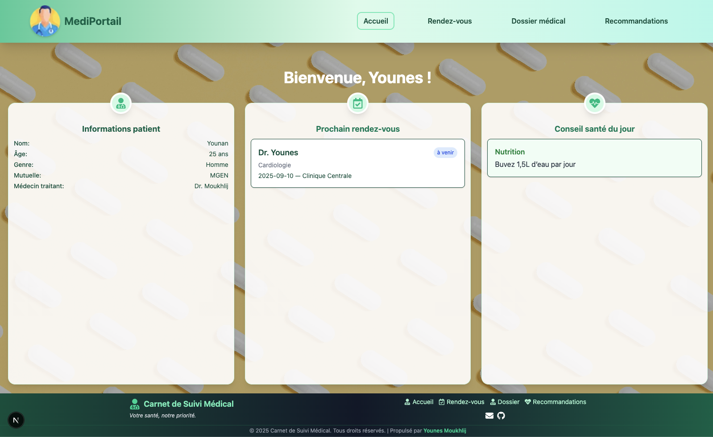

# Portail Patient – Visualisation d’un Carnet de Suivi Médical

Bienvenue sur le **Portail Patient**, une application Next.js moderne et responsive pour la gestion et la visualisation d’un carnet de suivi médical.

## Fonctionnalités principales

- 🩺 Visualisation du dossier médical (antécédents, allergies, traitements)
- 📅 Gestion des rendez-vous médicaux
- 💡 Recommandations et conseils santé personnalisés
- 🌗 Mode sombre/clair global
- 📱 Interface responsive adaptée à tous les écrans
- 🔒 Respect de la confidentialité des données

## Aperçu




## Technologies utilisées

- [Next.js](https://nextjs.org/) (App Router)
- [React](https://react.dev/)
- [Tailwind CSS](https://tailwindcss.com/) (avec support du mode sombre)
- [React Icons](https://react-icons.github.io/react-icons/)

## Structure du projet

```
portal-patient/
├── src/
│   ├── app/
│   │   ├── page.tsx (Accueil)
│   │   ├── dossier/page.tsx
│   │   ├── rendez-vous/page.tsx
│   │   ├── recommandations/page.tsx
│   ├── components/
│   │   ├── Header.tsx
│   │   ├── Footer.tsx
│   │   ├── AppointmentCard.tsx
│   │   ├── HealthTipCard.tsx
│   │   └── FilterTabs.tsx
│   ├── context/
│   │   └── DarkModeContext.tsx
│   ├── data/
│   │   ├── dossier.json
│   │   ├── recommandations.json
│   │   └── rendezvous.json
│   └── app/globals.css
├── public/
│   ├── doctor1.png
│   ├── bg1.jpg
│   ├── bg2.jpg
│   └── bg3.jpg
├── tailwind.config.js
├── package.json
└── ...
```

## Installation et lancement

1. **Cloner le dépôt**

```bash
git clone https://github.com/YounesMoukhlij/Portail-Patient-Visualisation-d-un-Carnet-de-Suivi-M-dical.git
cd Portail-Patient-Visualisation-d-un-Carnet-de-Suivi-M-dical/portal-patient
```

2. **Installer les dépendances**

```bash
npm install
```

3. **Démarrer le serveur de développement**

```bash
npm run dev
```

4. **Accéder à l’application**

Ouvrez [http://localhost:3000](http://localhost:3000) dans votre navigateur.

## Personnalisation

- Modifiez les données dans `src/data/` pour adapter le portail à vos besoins.
- Ajoutez vos propres composants ou pages dans `src/components/` et `src/app/`.

## Contribution

Les contributions sont les bienvenues ! N’hésitez pas à ouvrir une issue ou une pull request.

## Licence

Projet open-source sous licence MIT.

---

Développé par Younes Moukhlij – 2025
